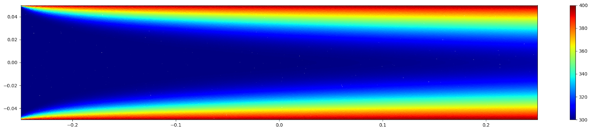
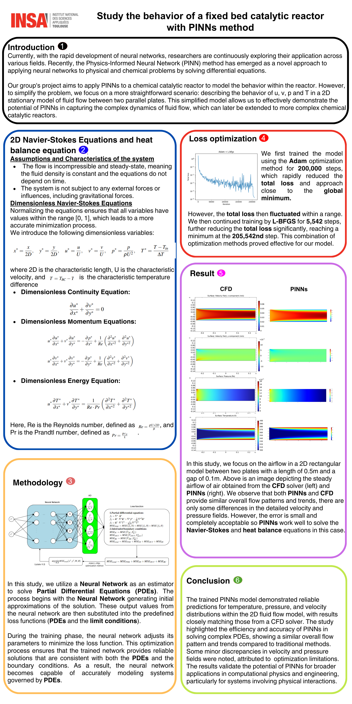

# PINNs in Catalytic Reactor

## Objective
In this project, our team experimented Physics-Informed Neural Network approach to stimulate a 2D model in a naive Catalytic Reactor. The approach's result is competitive to traditional Computational Fluid Dynamics method, but is less computational & data-intensive, further showcasing the potential of applying PINNs into solving fluid dynamics and heat transfer problems.

 Temperature simulation in a 2D Catalytic Reactor by PINNs 

## Poster

## Implementation
The implementation code is presented in both Tensorflow and DeepXDE (a library for applying PINNs at ease) in `2D_deepxde.ipynb` and `2D_tensorflow.ipynb`.
